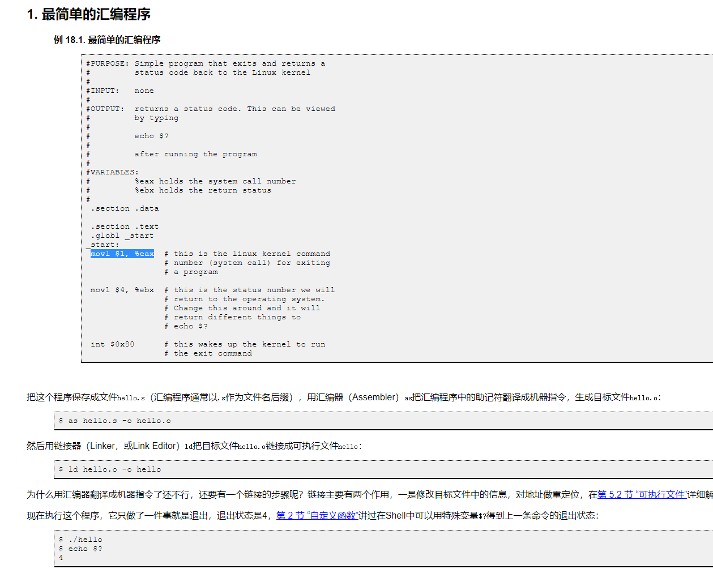
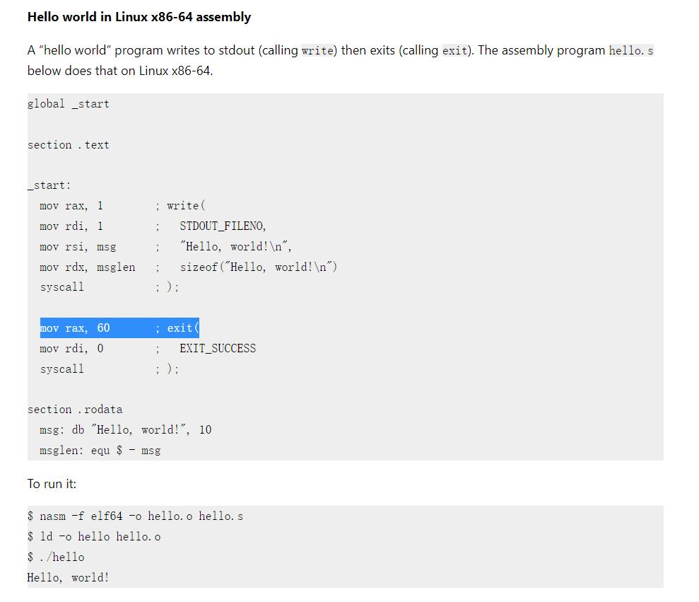

# 工作日志

## 2022-12-01

### 运行 hello world

将一块翻译好的 x86 指令复制到指定地址。

跳转过去执行。

目前就不跳回来了，因为中间的 context 啥都没保存，因此只能 print hello world 。

而且寄存器映射也还有点问题。

### syscall id 翻译

目前只有 sys write ，所以就 hardcode 了。

发现一个有意思的事情：i386 和 x86 的 linux syscall table 完全不一样，且用 as 命令编译汇编程序对应 x86 的，nasm 对应 i386 的。且二者编译出来的 binary 的 header 都一样，无法区分用的是哪个 syscall table 。




猜测可能就是用 int 80 和 syscall 指令区分二者。

经过实验，ecall 翻译成 int 0x80 会出问题，因此采用翻译成 syscall 。

## 2022-11-30

### 生成 x86 指令

将 RiscInst 通过 crate icde_x86 翻译成对应的 x86 指令。

## 2022-11-19

### 解码 riscv 指令

原始指令由 u32 包装为 RawRiscInst ，然后翻译成更便于使用的 RiscInst 。

## 2022-11-17

### 跳转到待翻译地址

做了翻译的前期准备工作。

## 2022-11-11

### 分配了一片空间，用于存放翻译后的 x86 指令。

在 readme 中增加了 xybt 和 ria-jit 分别的内存布局图。

### 创建了 riscv reg 结构体

## 2022-11-10

### 拷贝 auxv、envp、argv、argc 到用户栈中

注意栈指针需要 16 位对齐。

## 2022-11-09

### 把 translator 放入指定地址

尝试通过 rcore tutorial 那样加 linker.ld 的方案，不知为何会导致 libc 编译错误，修改无果。

尝试直接通过编译参数把程序放入高地址，然后找到的命令无法使用，且 rust 和 c 的编译存在一些 gap 。

后来找到了 c 里设置 text 段的地址的方案（因 gcc 版本更替导致命令改过名，我使用 `-Ttext 0x780000000000` ，网上的都是 `-Ttext-segmengt 0x780000000000`），但是无法将地址设置得太大。

最终解决方案：

```
[target.x86_64-unknown-linux-gnu]
rustflags = [
    "-Clink-args=-pie -fPIE -Wl,-Ttext-segment=0x780000000000",
]
```

通过 `readelf a.out -S` 可以看到程序被放到了正确的地址。

## 2022-11-08

### 把 elf 映射到内存中

通过 mmap 读出 elf 的中 load 类型的 segment ，这部分是需要加载到内存中的。记录最高地址和最低地址，把这中间的部分通过 mmap 分配给翻译器，然后把 segment 拷贝到相应的地址。

## 2022-11-07

### 初步读取 elf

学习了如何读 elf header、program header、section header，以及部分变量的作用。

后续好像会用到 phdr 的起始地址，是用 elf 的开始地址加上 elf_hdr.e_phoff 算出来的。其中 elf 的开始地址是用第一个 segment 的 program_hdr.p_vaddr - program_hdr.p_offset 算出来的。（理论上每个一 segment 算出来的这个值应该一样，但是实际上缺不一样，也许是我理解的有问题，望指正）第一个 senment 的地址是最低的。
